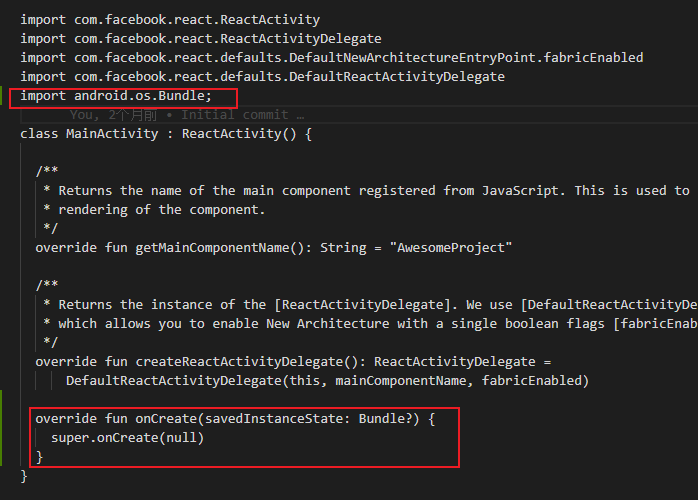

```js
npm install @react-navigation/native @react-navigation/native-stack react-native-screens react-native-safe-area-context
```

#### 配置

```js
// 编辑MainActivity.kt文件
// 该文件位于项目根目录下的android/app/src/main/java/<你的包名>/MainActivity.kt

import android.os.Bundle;

class MainActivity : ReactActivity() {
  override fun onCreate(savedInstanceState: Bundle?) {
    super.onCreate(null)
  }
}
```

