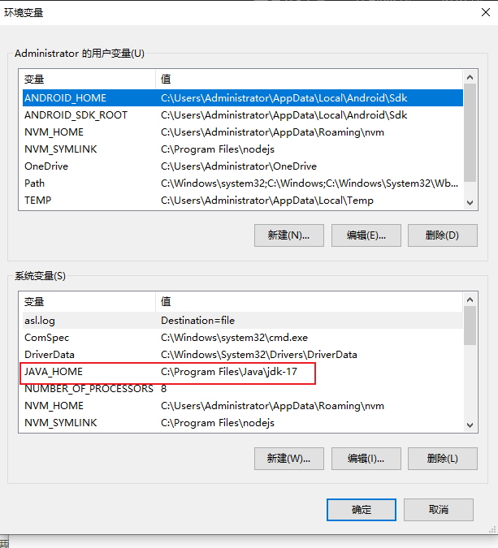
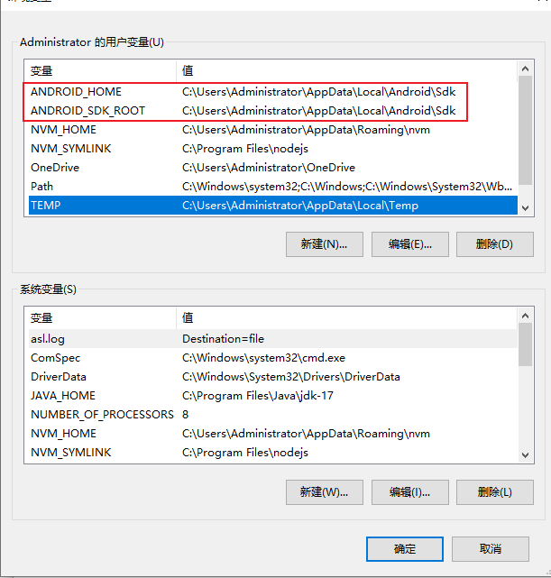
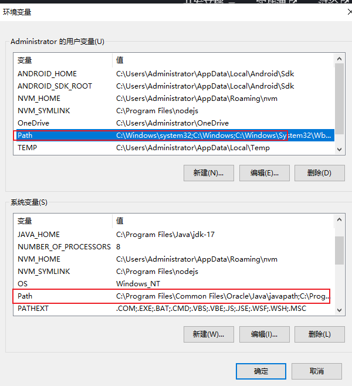
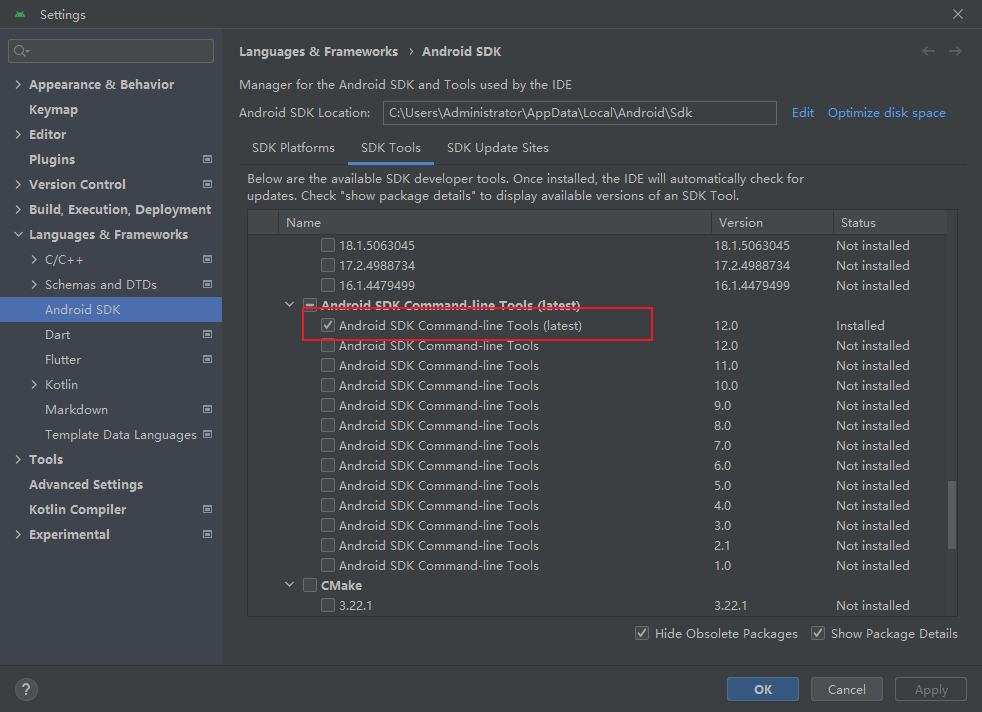

#### 1.下载JDK 17版本

https://www.oracle.com/cn/java/technologies/downloads/#java17

环境变量设置



#### 2. 安装 Android Studio

安装时目录全部都使用默认的！！！

环境变量配置



```
设置这两个环境变量

ANDROID_HOME
ANDROID_SDK_ROOT

C:\Users\Administrator\AppData\Local\Android\Sdk
```



```
分别在这两个path里添加以下4个

%ANDROID_HOME%\platform-tools
%ANDROID_HOME%\emulator
%ANDROID_HOME%\tools
%ANDROID_HOME%\tools\bin
```

然后打开Android Studio进入设置安装该工具

